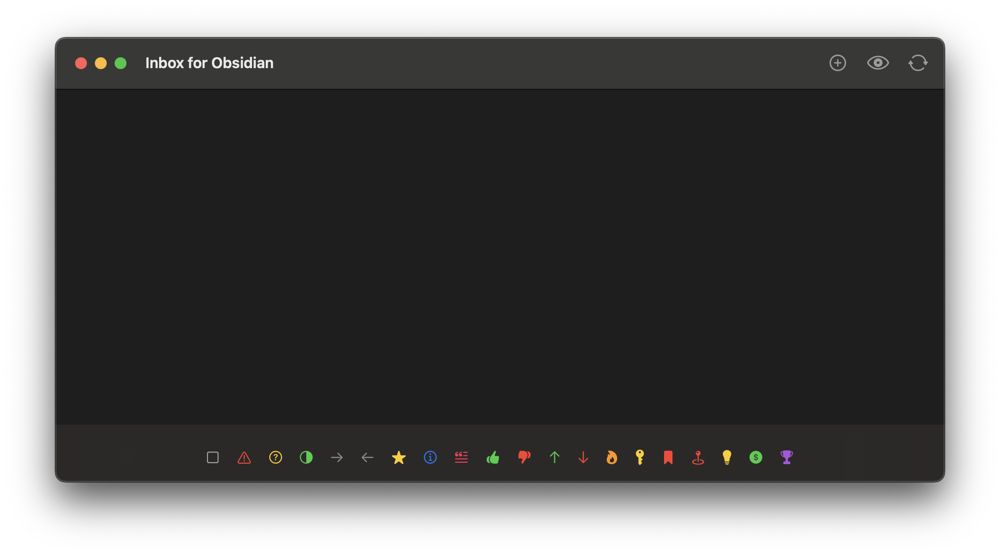
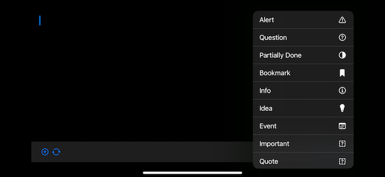

# Inbox for Obsidian -- MVP Specification

## Overview

A minimalist app for iOS (and iPadOS, MacOS, and VisionOS) for ultra-fast Markdown capture, tightly integrated with Obsidian.md. Opens instantly to a text editor for quick note-taking or task capture, using local SwiftData storage (synced with iCloud) and a manual push to Obsidian to prevent sync conflicts.

# Core Features

 1.  Instant Launch: Starts in a focused text editor, no splash or delay. Keyboard appears immediately.
 2.  Quick Task Markers: Tap a toolbar button to insert Markdown tasks (e.g. - [!]) or to toggle task types. A dedicated menu handles ~20 statuses with SF Symbols.
 3.  Local-First, iCloud-Synced: Notes are saved with SwiftData. Each note is a record with content, creation date, and a synced flag.
 4.  Deferred Obsidian Sync: A “Push” button appends unsynced notes to the vault’s daily notes via obsidian://actions-uri, then marks them synced.
 5.  Smart Draft Retention: If you leave the app for under 30 seconds, your text remains. If longer, it saves that draft and clears for a fresh note.

## Screenshots

# Technical Notes

 - SwiftUI + SwiftData: iOS 17+ with CloudKit for private syncing.
 - Clipboard Awareness: When inserting a bookmark, auto-paste URLs or text.
 - No Conflicts: Notes append to Obsidian using its Actions URI plugin.

# Next up prios

 - [x] Clean up Task Types, write some unit tests
 - [x] Data persistence
 - [x] Obsidian integration
 - [x] Background/foreground behavior (save and start new if foreground after > 30s, if < 30s stay on same item)
 - [x] Rotation and keyboard show/hide handling
 - [x] Native Vision OS support (with "ornaments" bar)
 - [ ] Advanced paste behavior (handle URLs, short text, long text)
 - [ ] Better iOS and macOS citizen (UI/UX: SwiftUI improvements, theming, and advanced features.)
 - [ ] AI features - low hanging fruit is selecting an appropriate icon when I don't have one. But there's a lot of ideas to explore. (This project is to some degree a platform for that exploration, but need some useful functionality first.)

## Further out (maybe not this weekend)

- voice ingest (WhisperKit? OpenAI's new agentic audio AIs?')
- Archive instead of delete, archive management
- handling data types other than text and voice (photo, video, etc.)
- multiple vault andline
